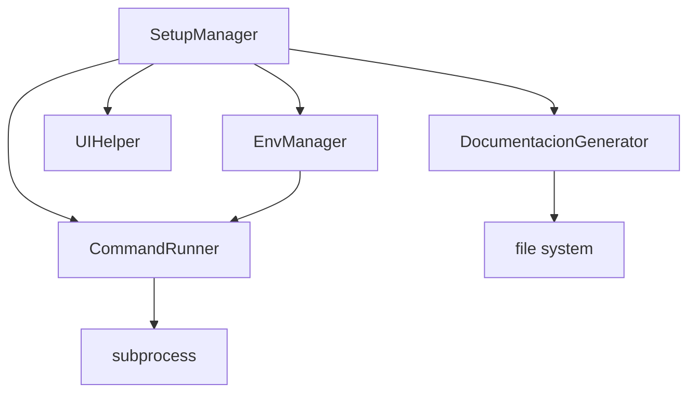

# Diseño del Proyecto WebGenesis

## Resumen Ejecutivo
WebGenesis es un generador modular de proyectos Python que facilita la creación y configuración de nuevos proyectos con una estructura profesional y herramientas de calidad preconfiguradas. El diseño se centra en la modularidad, extensibilidad y mantenibilidad.

## 1. Información General
- **Nombre**: modulo_WebGenesis
- **Versión Python**: 3.9
- **Fecha Creación**: 2025-03-05
- **Tipo**: Herramienta de Desarrollo
- **Licencia**: MIT

## 2. Arquitectura del Sistema

### 2.1 Estructura de Directorios
```
modulo_WebGenesis/
├── src/                    # Código fuente principal
│   ├── utils/             # Utilidades y módulos core
│   └── config/            # Configuraciones
├── docs/                  # Documentación
├── tests/                 # Pruebas unitarias y de integración
├── public_html/          # Frontend y assets estáticos
├── themes/               # Temas y estilos
├── plugins/              # Extensiones del sistema
└── .github/workflows/    # Configuración CI/CD
```

### 2.2 Componentes Principales


## 3. Módulos Core

### 3.1 SetupManager
- **Propósito**: Orquestación del proceso de setup
- **Responsabilidades**:
  * Gestión de operaciones
  * Manejo de rollback
  * Coordinación de módulos

### 3.2 CommandRunner
- **Propósito**: Ejecución segura de comandos
- **Características**:
  * Logging automático
  * Manejo de errores
  * Soporte para shell y cwd

### 3.3 EnvManager
- **Propósito**: Gestión de entornos virtuales
- **Funcionalidades**:
  * Creación de entornos Conda
  * Activación automática
  * Configuración Docker

## 4. Sistema de Configuración

### 4.1 settings.yaml
```yaml
defaults:
  project_name: str
  python_version: str
  base_location: str

directories: List[str]
vscode:
  paths: List[str]
```

### 4.2 Variables de Entorno
- **Archivo**: .env
- **Template**: .env.example
- **Variables Críticas**:
  * DATABASE_URL
  * SECRET_KEY
  * DEBUG

## 5. Herramientas de Calidad

### 5.1 Formateo y Linting
```yaml
tools:
  - black:
      line-length: 88
      target-version: py39
  - flake8:
      max-line-length: 88
      extend-ignore: E203
  - isort:
      profile: black
      multi_line_output: 3
```

### 5.2 Pre-commit Hooks
```yaml
repos:
  - repo: https://github.com/psf/black
  - repo: https://github.com/pycqa/flake8
  - repo: https://github.com/pycqa/isort
```

## 6. CI/CD Pipeline

### 6.1 GitHub Actions
```yaml
jobs:
  test:
    steps:
      - name: Tests
      - name: Linting
      - name: Type Checking
      - name: Security Scan
```

### 6.2 Verificaciones Automáticas
- Pruebas unitarias
- Cobertura de código
- Calidad de código
- Vulnerabilidades

## 7. Justificación del Diseño

### 7.1 Principios SOLID
- **Single Responsibility**: Módulos con propósito único
- **Open/Closed**: Extensible vía plugins
- **Interface Segregation**: APIs mínimas
- **Dependency Inversion**: Inyección de dependencias

### 7.2 Patrones de Diseño
- **Factory**: Creación de objetos
- **Command**: Ejecución de comandos
- **Strategy**: Configuración flexible
- **Observer**: Logging y eventos

## 8. Instrucciones de Uso

### 8.1 Configuración Inicial
```bash
# Activar entorno
conda activate modulo_WebGenesis

# Instalar dependencias
conda env update -f environment.yml

# Configurar pre-commit
pre-commit install
```

### 8.2 Desarrollo
```bash
# Abrir VS Code
code .

# Ejecutar tests
pytest

# Verificar formato
black .
flake8
```

## 9. Extensibilidad

### 9.1 Sistema de Plugins
- **Ubicación**: /plugins
- **Formato**: Python modules
- **Carga**: Dinámica

### 9.2 Temas
- **Ubicación**: /themes
- **Formato**: Templates
- **Personalización**: CSS/JS

## 10. Mantenimiento

### 10.1 Logs
- **Ubicación**: project_setup.log
- **Formato**: JSON
- **Rotación**: Diaria

### 10.2 Actualizaciones
- Dependencias: Mensual
- Seguridad: Semanal
- Documentación: Por cambio

## 11. Roadmap
1. **Fase 1**: Core ✓
2. **Fase 2**: Plugins
3. **Fase 3**: Web UI
4. **Fase 4**: Cloud Integration
